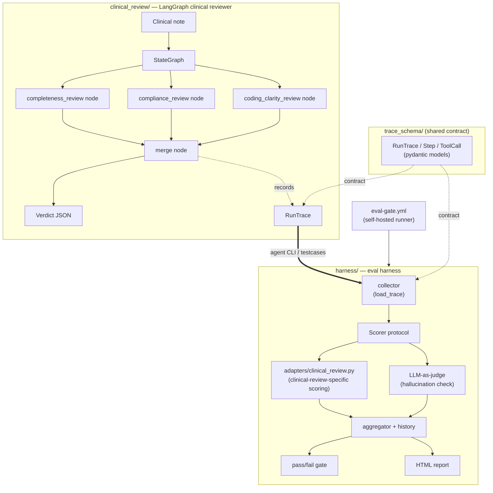

# agent-eval-harness

An eval harness for AI agents, paired with a multi-agent clinical
documentation review agent. The two share a common `trace_schema` contract
so a run can be recorded, replayed, and scored independently of the agent's
implementation — the harness never imports from the agent's internals.

This repo currently contains:

- `trace_schema/` — the shared `RunTrace`/`Step`/`ToolCall` pydantic contract
  that any agent run (and the harness) is recorded against.
- `clinical_review/` — a LangGraph multi-agent clinical documentation
  reviewer. Completeness, compliance, and coding-clarity nodes fan into a
  merge node that produces a verdict via a local Ollama model, plus a
  `trace_schema.RunTrace` of the run.
- `harness/` — an eval harness (trace collector, pluggable `Scorer`
  protocol, pass/fail gate, and HTML report/dashboard). Domain-specific
  scoring logic lives in `harness/adapters/clinical_review.py`; the harness
  core has no clinical-review-specific code in it.

## Structure



`clinical_review/` and `harness/` never import from each other's internals
— the only shared dependency is `trace_schema`, and the only integration
point is `harness/cli.py` invoking the agent's public `run_review()` entry
point to produce traces for scoring.

**Note on `task_success`/`tool_call_correctness` vs. hallucination scoring:**
`task_success` and `tool_call_correctness` (in
`harness/adapters/clinical_review.py`) are deterministic comparisons
against ground-truth `expected.json` — no LLM involved. Only
`hallucination_rate` uses an LLM-as-judge (`harness/judge.py`), and that
judge model is independently configurable from the agent's own model.

## Running locally

```bash
uv sync
ollama pull qwen2.5:7b
```

Run `uv run pytest` from the repo root to run the full test suite across
`trace_schema/tests/`, `harness/tests/`, and `clinical_review/tests/` (pass
`-m "not integration"` to skip the tests that require a running local
Ollama).

### Clinical documentation review agent (`clinical_review/`)

Reviews a clinical note's *documentation quality* — completeness,
compliance, coding clarity — not its medical correctness.

**This is an illustrative portfolio demo, not a clinical tool.** Its review
rules are example documentation-quality checks, not a real coding/compliance
authority, and it must never be used for actual patient care or clinical
decision-making.

```bash
uv run clinical-review review --note-file <path> --encounter-type {new_patient,follow_up}
```

Streamlit UI:
```bash
uv sync --extra ui
uv run streamlit run clinical_review/src/clinical_review/streamlit_app.py
```

### Running the eval harness

```bash
uv run harness gate-clinical-review --testcases-dir clinical_testcases \
  --history-path docs/results/clinical_history.json \
  --report-out docs/results/clinical_report.html --commit-sha "$(git rev-parse HEAD)"
```

See `docs/results/clinical_report.html` for an example of the harness's
output. As of the latest committed run, the agent passes 19/25 (76%) of the
illustrative test cases; a small local 7B model driven by simple demo
prompts can over-flag or under-flag documentation issues, and that's
expected behavior for a portfolio agent, not a bug.

The average hallucination rate across judged issues in this run is ~71%,
which is worth reading carefully: `harness/judge.py`'s `HallucinationJudge`
is, by default, the same `qwen2.5:7b` model that generated the agent's
output in the first place, so a high rate here reflects the judge's
reliability at this model size at least as much as the agent's. The judge
model is passed independently of the agent model and can be pointed at a
different one to separate those two effects.

## Known limitation: self-hosted runner required

`.github/workflows/eval-gate.yml` runs on `runs-on: self-hosted` because it
shells out to a local Ollama instance (`qwen2.5:7b`). **This workflow will
not work on GitHub-hosted runners** — they cannot reach a local Ollama
instance, and there is no hosted Ollama equivalent wired up. To use it,
register a self-hosted runner that has Ollama installed and the
`qwen2.5:7b` model already pulled.
