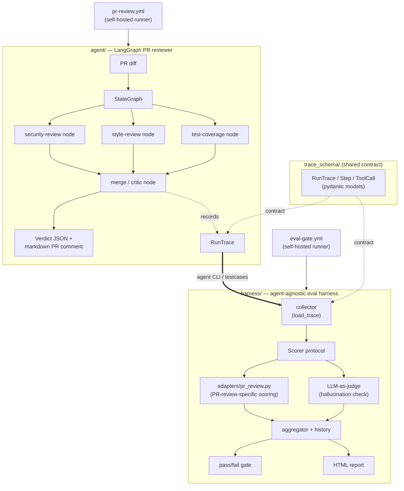

# pr-review-eval

A decoupled PR-review agent and eval harness, sharing a common
`trace_schema` contract so review runs can be recorded, replayed, and scored
independently of the agent implementation.

This repo currently contains:

- `trace_schema/` — the shared `RunTrace`/`Step`/`ToolCall` pydantic contract
  that any review run (agent or harness) is recorded against.
- `agent/` — a LangGraph multi-agent PR reviewer. It runs security, style,
  and test-coverage review nodes against a diff, merges their findings into a
  verdict via a local Ollama model, and emits a `trace_schema.RunTrace` plus
  a markdown PR comment.
- `harness/` — a generic, agent-agnostic eval harness (trace collector,
  pluggable `Scorer` protocol, pass/fail gate, and HTML report/dashboard). 
  PR-review-specific scoring logic lives in `harness/adapters/pr_review.py`; 
  swapping in a different agent means writing a new adapter, while the 
  harness core remains unchanged.

## Structure



`agent/` and `harness/` never import from each other's internals — the only
shared dependency is `trace_schema`, and the only integration point is
`harness/cli.py` invoking the agent's public `run_review()` entry point to
produce traces for scoring. `harness/streamlit_app.py` is a second such
integration point — a UI that runs the agent, then scores the resulting
trace with the harness (see "Streamlit UI" below).

## Running locally

```bash
uv sync
ollama pull qwen2.5:7b
uv run agent review --diff-file <path-to-diff-file>
```

This writes `trace.json` (a `RunTrace`) and `comment.md` (the PR comment) to
the current directory by default; override with `--trace-out` /
`--comment-out`. Run `uv run pytest` from the repo root to run the full test
suite across `trace_schema/tests/` and `agent/tests/` (pass
`-m "not integration"` to skip the test that requires a running local
Ollama).

### Running the eval harness

```bash
uv run harness gate --testcases-dir testcases --history-path history.json \
  --report-out report.html --commit-sha "$(git rev-parse HEAD)"
```

This runs the harness against the synthetic test suite and produces an HTML 
report. See `docs/results/report.html` for an example of the harness's output.

### Streamlit UI

```bash
uv sync --extra ui
uv run streamlit run harness/src/harness/streamlit_app.py
```

Lets you either upload your own diff (runs the agent, then a hallucination-only
check since there's no expected verdict to score against) or pick one of the
`testcases/` scenarios (runs the agent, then the full harness score —
`task_success`, `tool_call_correctness`, `hallucination_rate` — against its
`expected.json`). Lives in `harness/` rather than `agent/` since it depends on
both packages, matching the one-directional dependency `harness -> agent`.

## Known limitation: self-hosted runner required

`.github/workflows/pr-review.yml` and `.github/workflows/eval-gate.yml` both 
run on `runs-on: self-hosted` because they shell out to a local Ollama instance 
(`qwen2.5:7b`). **These workflows will not work on GitHub-hosted runners** — 
they cannot reach a local Ollama instance, and there is no hosted Ollama 
equivalent wired up. To use the workflows, register a self-hosted runner that 
has Ollama installed and the `qwen2.5:7b` model already pulled.
